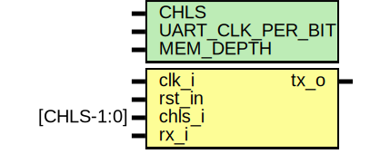

# logIP

<p align="center">
  
</p>

logIP is a utilization-aware logic analyzer IP core the can be synthesized along the actual design to trace signals in operation. E.g., internal signals of an FPGA design can be observed in regular operation without modifying the design files. logIP is based on the [SUMP](https://sump.org/projects/analyzer/protocol/) protocol and already prepares all required interfaces to implement the fully-featured [OLS extensions](http://dangerousprototypes.com/docs/Logic_Analyzer_core:_Background). While implementations of the [SUMP](https://sump.org/projects/analyzer/protocol/) protocol already exist, the main focus is to adapt the logic analyzer core to specific needs. This project was originally developed as part of the Design of Real-Time Systems Laboratory at the Institute of Technical Informatics at Graz University of Technology. 

## Block Diagram 
This section aims to illustrate the architecture of the logIP implementation. The block diagrams depict the main interactions between the modules. Please note that many signals are not explicitly drawn due to clarity.
### Top Level View
The top-level instantiates the receiver, transmitter, the RAM, and the logIP core. The core implements the architecture independent logic.

<p align="center">
  
</p>

### Core Level View
In the following diagram, the instantiations within the core are depicted.

<p align="center">
  
</p>

## Input Channels
Up to 32 input channels are available that can be connected to design signals. The number of channels can be decreased in multiples of eight to save sampling memory. IMPORTANT: De-activation of channel groups are not yet suported. Even when not all channels are synthesized, all channel groups must be activated in the client.

## Sampling Memory
Samples are stored in a sampling memory (RAM) accessed by an interface layer. The handshaking is kept simple to ease modification and extensions. Currently, the RAM can be synthesized of LUT's or (Xilinx) block ram (BRAM). However, changes to use external RAM are also possible. Memory size (in the number of samples) can be set by module parameters.

## Folder Structure
The folder structure is given as follows: `demo` holds demonstration projects that can be synthesized and tested out-of-the-box. `doc` contains all documentation files of logIP. `fv` contains files for formally verifying the design. All generated files, such as the bitstream, reports, etc., are collected in `out`. All scripts to, e.g., run the simulation are located in `scripts`. The design files themselves are placed in `src`. The repository contains an extensive testbench framework put in `tb` along with the design. Finally, `utils` have submodules and the test-pattern generator.

```
.
├── demo            Demo projects
|   └── basys3
├── doc             Documentation
├── fv              Formal scripts
├── out             Generated files like bitstreams
├── README.md
├── scripts         Scripts to build, analyze, report, ...
├── sim             Simulation files
├── src             RTL source files and IP cores
├── tb              Testbenches
└── utils           External utils like git submodules
    └── tpg

```

# Design Documentation
The following table provides a link to the documentation of each module. Note: The HDL itself is documented verbose and meaningful fashion and might help further understand the design.

| Module Name | Usage                     | Documentation                                 |
| ----------- | ------------------------- | --------------------------------------------  |
| logIP       | Top Level, logIP          | [logIP ](./doc/doc_internal/logIP.md)         |
| logIP_pkg   | Package                   | [logIP_pkg ](./doc/doc_internal/logIP_pkg.md) |
| core        | logIP Core                | [core ](./doc/doc_internal/core.md)           |
| ctrl        | Controller, Main FSM      | [ctrl ](./doc/doc_internal/ctrl.md)           |
| indec       | Instruction Decoder       | [indec ](./doc/doc_internal/indec.md)         |
| ramif       | RAM Interface Memory      | [ramif ](./doc/doc_internal/ramif.md)         |
| lutram      | LUT RAM Memory            | [lutram ](./doc/doc_internal/lutram.md)       |
| rdback      | Readback (ID, Metadata)   | [rdback ](./doc/doc_internal/rdback.md)       |
| sampler     | Sampler of Input Channels | [sampler ](./doc/doc_internal/sampler.md)     |
| stage       | Single Trigger Stage      | [stage ](./doc/doc_internal/stage.md)         |
| trigger     | Trigger: 4 Stages         | [trigger ](./doc/doc_internal/trigger.md)     |
| tuart_rx    | (Tiny) UART receiver      | [tuart_rx ](./doc/doc_internal/tuart_rx.md)   |
| tuart_tx    | (Tiny) UART transmitter   | [tuart_tx ](./doc/doc_internal/tuart_tx.md)   |
| syncro      | Synchronizer, legacy      | [syncro ](./doc/doc_internal/syncro.md)       |


# Simulations
In `/tb` almost all modules come with an individual testbench to verify their behavior. One folder (`frwk`) is reserved for the framework itself. The framework provides helper functions/macros and models a fully-featured client to simulate the end-to-end behavior. In addition, the test framework offers a mailbox-based system to get a summary report of failed assertions.
```
tb/
├── core
├── ctrl
├── frwk       <-- Testbench framework
├── indec
├── logIP
├── sampler
├── stage
├── trigger
├── tuart_rx
└── tuart_tx
```

The structure of each testbench is similar and consists of (at least) four files. 
```
tb/<module>/
├── dut_if.sv
├── dut_tester.sv
├── dut_wrapper.sv
└── <module>_tb.sv
```

`dut_if.sv` provides the interface to the device under test (DUT) and sets the modport and clocking block accordingly. In `dut_wrapper.sv`, the DUT is instantiated and connected to its interface. `dut_tester.sv` applies the test stimuli and monitors the behavior. In `<module>_tb.sv` all parts are instantiated and the main system clock is generated.


A script is provided for convenience to run the testbench for a particular module.
```
cd <repo>/scripts
./run_sim.sh -d <module_name>
./run_again.sh
```


# Demos
Demos are placed in `<repo>/demo`.
## Basys3
In this demo, logIP is instantiated and connected to the test-pattern generator. The incoming and outgoing Uart signals are repeated at two I/O pins for debugging.

The following script can start synthesis and implementation. After the script has successfully finished, the bitstream and reports are copied to `<repo>/demo/basys3/out`.
```
cd <repo>/demo/basys3/scripts
./run_impl.sh
```

Another script can be run to program the bitstream into volatile configuration memory.
```
./run_prog.sh
```

# Clients
The following is a non-extensive list of available clients that support the SUMP protocol.
* [Original SUMP Client](https://sump.org/projects/analyzer/)
* [Pulseview / Sigrok](https://sigrok.org/)
* [Open Logic Sniffer](https://github.com/jawi/ols)


# Instantiation
The following shows an instantiation template of the logIP logic analyzer IP. `CHLS` sets the number of input channels to be synthesized. `MEM_DEPTH` adjusts the size of the sampling memory in bits (`10 = 2^10` samples per channel) and `UART_CLK_PER_BIT` sets the Uart baud -rate relative to the system clock.

```
logIP #(.CHLS(32),
        .MEM_DEPTH(10),
        .UART_CLK_PER_BIT(CLK_PER_BIT)) i_logIP (
  .clk_i    (clk), 
  .rst_in   (rst),
  .chls_i   (chls),
  .rx_i     (uart_rx_i),  
  .tx_o     (uart_tx_o)
);
```

# Formal 

TODO


# Authors
+ Meinhard Kissich
+ Klaus Weinbauer

# Issues
The [Original SUMP Client](https://sump.org/projects/analyzer/) depends on the RXTX library that can be found [here](http://rxtx.qbang.org/wiki/index.php/Download). Please make sure to use version [rxtx-2.2pre2.zip](http://rxtx.qbang.org/pub/rxtx/rxtx-2.2pre2.zip) and `openjdk-8-jre`. The default java version can be changed by `sudo update-alternatives --config java`.
