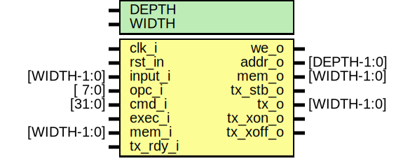

# Entity: core 

- **File**: core.sv
## Diagram

## Generics

| Generic name | Type | Value | Description                  |
| ------------ | ---- | ----- | ---------------------------- |
| DEPTH        |      | 5     | memory depth / address width |
| WIDTH        |      | 32    |                              |
## Ports

| Port name | Direction | Type        | Description                      |
| --------- | --------- | ----------- | -------------------------------- |
| clk_i     | input     |             | system clock                     |
| rst_in    | input     |             | system reset, low active         |
| input_i   | input     | [WIDTH-1:0] | input to sample                  |
| opc_i     | input     | [ 7:0]      | opcpde                           |
| cmd_i     | input     | [31:0]      | command data                     |
| exec_i    | input     |             | execute command                  |
| we_o      | output    |             | write enable                     |
| addr_o    | output    | [DEPTH-1:0] | memory address                   |
| mem_i     | input     | [WIDTH-1:0] | input from memory                |
| mem_o     | output    | [WIDTH-1:0] | output to memory                 |
| tx_rdy_i  | input     |             | transmitter ready flag           |
| tx_stb_o  | output    |             | starts transmitter               |
| tx_o      | output    | [WIDTH-1:0] | data for the transmitter to send |
| tx_xon_o  | output    |             | transmitter flow control on      |
| tx_xoff_o | output    |             | transmitter flow control on      |
## Signals

| Name               | Type              | Description |
| ------------------ | ----------------- | ----------- |
| rst_n              | logic             |             |
| sft_rst            | logic             |             |
| arm                | logic             |             |
| id                 | logic             |             |
| set_mask           | logic             |             |
| set_val            | logic             |             |
| set_cfg            | logic             |             |
| set_div            | logic             |             |
| set_cnt            | logic             |             |
| set_flgs           | logic             |             |
| stg                | logic [1:0]       |             |
| smpls              | logic [WIDTH-1:0] |             |
| smpls_stb          | logic             |             |
| run                | logic             |             |
| tx_stb_from_rdback | logic             |             |
| tx_stb_from_ctrl   | logic             |             |
| tx_sel_ram         | logic             |             |
| tx_from_ram        | logic [WIDTH-1:0] |             |
| tx_from_rdback     | logic [WIDTH-1:0] |             |
## Constants

| Name  | Type | Value | Description |
| ----- | ---- | ----- | ----------- |
| WIDTH |      | 32    |             |
## Instantiations

- i_indec: indec
- i_sampler: sampler
- i_trigger: trigger
- i_ctrl: ctrl
- i_rdback: rdback
