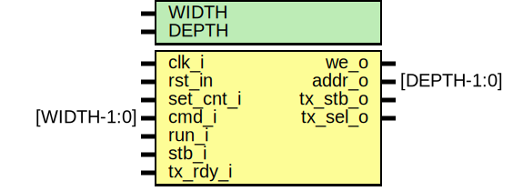
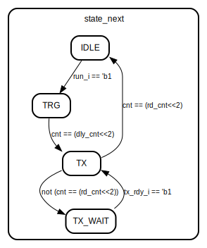

# Entity: ctrl 

- **File**: ctrl.sv
## Diagram

## Generics

| Generic name | Type | Value | Description                  |
| ------------ | ---- | ----- | ---------------------------- |
| WIDTH        |      | 32    |                              |
| DEPTH        |      | 5     | memory depth / address width |
## Ports

| Port name | Direction | Type        | Description                               |
| --------- | --------- | ----------- | ----------------------------------------- |
| clk_i     | input     |             | system clock                              |
| rst_in    | input     |             | system reset, low active                  |
| set_cnt_i | input     |             | configure the amount of samples to return |
| cmd_i     | input     | [WIDTH-1:0] | command data                              |
| run_i     | input     |             | trigger sampling                          |
| stb_i     | input     |             | indicates that sample is ready            |
| we_o      | output    |             | write enable                              |
| addr_o    | output    | [DEPTH-1:0] | memory address                            |
| tx_rdy_i  | input     |             | transmitter ready flag                    |
| tx_stb_o  | output    |             | starts transmitter                        |
| tx_sel_o  | output    |             | select ram data to write back             |
## Signals

| Name       | Type                  | Description |
| ---------- | --------------------- | ----------- |
| state      | states_t              |             |
| state_next | states_t              |             |
| rd_cnt     | logic [CNT_WIDTH-1:0] |             |
| dly_cnt    | logic [CNT_WIDTH-1:0] |             |
| cnt        | logic [CNT_WIDTH+3:0] |             |
| cnt_next   | logic [CNT_WIDTH+3:0] |             |
| ptr        | logic [DEPTH-1:0]     |             |
| ptr_next   | logic [DEPTH-1:0]     |             |
## Constants

| Name      | Type | Value     | Description |
| --------- | ---- | --------- | ----------- |
| WIDTH     |      | 32        |             |
| CNT_WIDTH |      | WIDTH / 2 |             |
## Types

| Name     | Type                                                                                                                                                                                      | Description |
| -------- | ----------------------------------------------------------------------------------------------------------------------------------------------------------------------------------------- | ----------- |
| states_t | enum bit [1:0] {  IDLE,  TRG,  TX,  TX_WAIT } |             |
## Processes
- main_fsm: (  )
  - **Type:** always_comb
- fsm: ( @(posedge clk_i ) )
  - **Type:** always_ff
- set_cnt: ( @(posedge clk_i) )
  - **Type:** always_ff
## State machines

