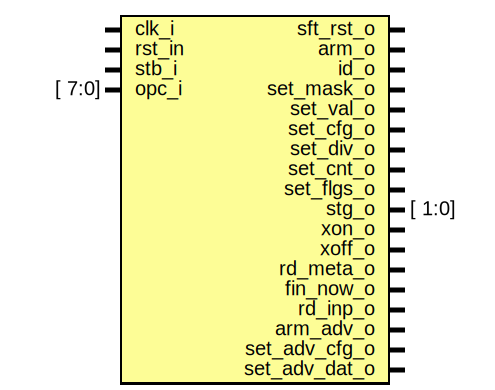

# Entity: indec 

- **File**: indec.sv
## Diagram

## Ports

| Port name     | Direction | Type   | Description                         |
| ------------- | --------- | ------ | ----------------------------------- |
| clk_i         | input     |        | system clock                        |
| rst_in        | input     |        | system reset, low active            |
| stb_i         | input     |        | flag for valid op-code input        |
| opc_i         | input     | [ 7:0] | command op-code                     |
| sft_rst_o     | output    |        | perform soft reset                  |
| arm_o         | output    |        | arm the trigger                     |
| id_o          | output    |        | request for device identification   |
| set_mask_o    | output    |        | set mask for trigger                |
| set_val_o     | output    |        | set trigger values                  |
| set_cfg_o     | output    |        | configure trigger stage             |
| set_div_o     | output    |        | set frequency divider               |
| set_cnt_o     | output    |        | set the amount of samples to return |
| set_flgs_o    | output    |        | configure flags                     |
| stg_o         | output    | [ 1:0] | stage                               |
| xon_o         | output    |        | put transmitter out of pause mode   |
| xoff_o        | output    |        | put transmitter in pause mode       |
| rd_meta_o     | output    |        |                                     |
| fin_now_o     | output    |        |                                     |
| rd_inp_o      | output    |        |                                     |
| arm_adv_o     | output    |        |                                     |
| set_adv_cfg_o | output    |        |                                     |
| set_adv_dat_o | output    |        |                                     |
## Signals

| Name   | Type     | Description |
| ------ | -------- | ----------- |
| opc    | opcode_t |             |
| f_init | logic    |             |
## Processes
- opcode_decoding: (  )
  - **Type:** always_comb
- f_initial_reset: ( @(posedge clk_i) )
  - **Type:** always_ff
- f_inputs_ok: ( @(posedge clk_i) )
  - **Type:** always_ff
