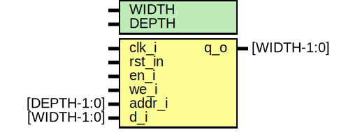

# Entity: lutram 

- **File**: lutram.sv
## Diagram

## Generics

| Generic name | Type | Value | Description |
| ------------ | ---- | ----- | ----------- |
| WIDTH        |      | 32    |             |
| DEPTH        |      | 3     |             |
## Ports

| Port name | Direction | Type        | Description                 |
| --------- | --------- | ----------- | --------------------------- |
| clk_i     | input     |             | system clock                |
| rst_in    | input     |             | system reset                |
| en_i      | input     |             | enable                      |
| we_i      | input     |             | write enable (read / write) |
| addr_i    | input     | [DEPTH-1:0] | address                     |
| d_i       | input     | [WIDTH-1:0] | data in                     |
| q_o       | output    | [WIDTH-1:0] | data out                    |
## Signals

| Name       | Type              | Description |
| ---------- | ----------------- | ----------- |
| r_ram      | logic [WIDTH-1:0] |             |
| default    | endclocking       |             |
| f_pre_init | logic             |             |
| f_init     | logic             |             |
## Processes
- unnamed: ( @(posedge clk_i) )
  - **Type:** always_ff
- f_initial_reset: ( @(posedge clk_i) )
  - **Type:** always_ff
## Instantiations

- iff: disable
