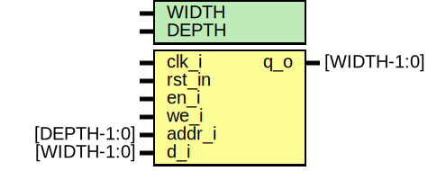

# Entity: ramif 

- **File**: ramif.sv
## Diagram

## Generics

| Generic name | Type | Value | Description |
| ------------ | ---- | ----- | ----------- |
| WIDTH        |      | 32    |             |
| DEPTH        |      | 5     |             |
## Ports

| Port name | Direction | Type        | Description                 |
| --------- | --------- | ----------- | --------------------------- |
| clk_i     | input     |             | system clock                |
| rst_in    | input     |             | system reset                |
| en_i      | input     |             | enable                      |
| we_i      | input     |             | write enable (read / write) |
| addr_i    | input     | [DEPTH-1:0] | address                     |
| d_i       | input     | [WIDTH-1:0] | data in                     |
| q_o       | output    | [WIDTH-1:0] | data out                    |
## Signals

| Name   | Type | Description |
| ------ | ---- | ----------- |
| either | Use  |             |
## Instantiations

- i_blk_mem_gen: blk_mem_gen_0
- i_lutram: lutram
