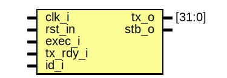

# Entity: rdback 

- **File**: rdback.sv
## Diagram

## Ports

| Port name | Direction | Type   | Description              |
| --------- | --------- | ------ | ------------------------ |
| clk_i     | input     |        | system clock             |
| rst_in    | input     |        | system reset, low active |
| exec_i    | input     |        | execute command          |
| tx_rdy_i  | input     |        | transceiver is ready     |
| id_i      | input     |        | flag to read back id     |
| tx_o      | output    | [31:0] | transmit data output     |
| stb_o     | output    |        | strobe transmit          |
