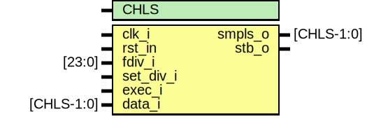

# Entity: sampler 

- **File**: sampler.sv
## Diagram

## Generics

| Generic name | Type | Value | Description |
| ------------ | ---- | ----- | ----------- |
| CHLS         |      | 32    |             |
## Ports

| Port name | Direction | Type       | Description                      |
| --------- | --------- | ---------- | -------------------------------- |
| clk_i     | input     |            | system clock                     |
| rst_in    | input     |            | system reset, low active         |
| fdiv_i    | input     | [23:0]     | new division factor, part of cmd |
| set_div_i | input     |            | flag to update division factor   |
| exec_i    | input     |            |                                  |
| data_i    | input     | [CHLS-1:0] | input channels                   |
| smpls_o   | output    | [CHLS-1:0] | sampled input channels           |
| stb_o     | output    |            | flag took sample                 |
## Signals

| Name    | Type             | Description |
| ------- | ---------------- | ----------- |
| r_div   | logic [23:0]     |             |
| cnt     | logic [23:0]     |             |
| r_smpls | logic [CHLS-1:0] |             |
| f_init  | logic            |             |
## Constants

| Name | Type | Value | Description |
| ---- | ---- | ----- | ----------- |
| CHLS |      | 32    |             |
## Processes
- take_samples: ( @(posedge clk_i) )
  - **Type:** always_ff
- set_fdiv: ( @(posedge clk_i) )
  - **Type:** always_ff
- f_initial_reset: ( @(posedge clk_i) )
  - **Type:** always_ff
- unnamed: ( @(posedge clk_i) )
  - **Type:** always_ff
