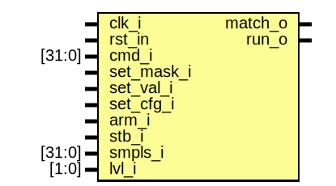
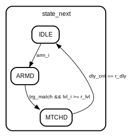

# Entity: stage 

- **File**: stage.sv
## Diagram

## Ports

| Port name  | Direction | Type   | Description                     |
| ---------- | --------- | ------ | ------------------------------- |
| clk_i      | input     |        | system clock                    |
| rst_in     | input     |        | system reset, low active        |
| cmd_i      | input     | [31:0] | command                         |
| set_mask_i | input     |        | flag, set trigger mask          |
| set_val_i  | input     |        | flag, set trigger value         |
| set_cfg_i  | input     |        | flag, set trigger configuration |
| arm_i      | input     |        | flag, arm trigger               |
| stb_i      | input     |        | flag, new data samples          |
| smpls_i    | input     | [31:0] | sampled channels                |
| lvl_i      | input     | [1:0]  | currently active level          |
| match_o    | output    |        | flag, trigger matched           |
| run_o      | output    |        | flag, trigger run               |
## Signals

| Name         | Type             | Description |
| ------------ | ---------------- | ----------- |
| cmd_bytes    | logic [3:0][7:0] |             |
| r_val        | logic [31:0]     |             |
| r_mask       | logic [31:0]     |             |
| r_dly        | logic [15:0]     |             |
| r_lvl        | logic [1:0]      |             |
| r_chl        | logic [31:0]     |             |
| r_ser        | logic            |             |
| r_act        | logic            |             |
| comp_vec     | logic [31:0]     |             |
| dly_cnt      | logic [15:0]     |             |
| dly_cnt_next | logic [15:0]     |             |
| state        | states_t         |             |
| state_next   | states_t         |             |
| smpls_shft   | logic [31:0]     |             |
| trg_match    | logic            |             |
| default      | endclocking      |             |
| f_pre_init   | logic            |             |
| f_init       | logic            |             |
| rst_in       | asme_init_rst    |             |
| set_mask_i   | asrt_nch_regs    |             |
| set_val_i    | asrt_nch_regs    |             |
| set_cfg_i    | asrt_nch_regs    |             |
| arm_i        | asrt_nch_regs    |             |
| smpls_shft   | asrt_shft        |             |
| r_mask       | asrt_set_mask    |             |
## Types

| Name     | Type                                                                                                                                           | Description |
| -------- | ---------------------------------------------------------------------------------------------------------------------------------------------- | ----------- |
| states_t | enum bit [1:0] { IDLE,  ARMD,  MTCHD} |             |
## Processes
- next_state_logic: (  )
  - **Type:** always_comb
- matching: ( @(posedge clk_i) )
  - **Type:** always_ff
- fsm: ( @(posedge clk_i) )
  - **Type:** always_ff
- update_configurations: ( @(posedge clk_i) )
  - **Type:** always_ff
- f_initial_reset: ( @(posedge clk_i) )
  - **Type:** always_ff
## Instantiations

- iff: disable
## State machines

