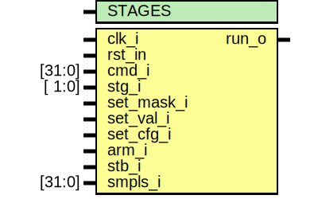

# Entity: trigger 

- **File**: trigger.sv
## Diagram

## Generics

| Generic name | Type | Value | Description |
| ------------ | ---- | ----- | ----------- |
| STAGES       |      | 4     |             |
## Ports

| Port name  | Direction | Type   | Description                     |
| ---------- | --------- | ------ | ------------------------------- |
| clk_i      | input     |        | system clock                    |
| rst_in     | input     |        | system reset, low active        |
| cmd_i      | input     | [31:0] | command                         |
| stg_i      | input     | [ 1:0] | stage                           |
| set_mask_i | input     |        | flag, set trigger mask          |
| set_val_i  | input     |        | flag, set trigger value         |
| set_cfg_i  | input     |        | flag, set trigger configuration |
| arm_i      | input     |        | flag, arm trigger               |
| stb_i      | input     |        | flag, new data samples          |
| smpls_i    | input     | [31:0] | sampled channels                |
| run_o      | output    |        | flag, trigger run               |
## Signals

| Name     | Type               | Description |
| -------- | ------------------ | ----------- |
| set_mask | logic [STAGES-1:0] |             |
| set_val  | logic [STAGES-1:0] |             |
| set_cfg  | logic [STAGES-1:0] |             |
| run      | logic [STAGES-1:0] |             |
| match    | logic [STAGES-1:0] |             |
| r_lvl    | logic [1:0]        |             |
## Processes
- fsm: ( @(posedge clk_i) )
  - **Type:** always_ff
