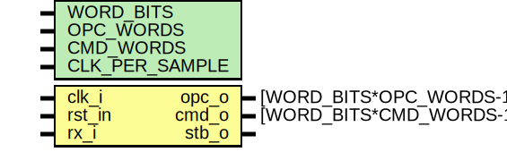
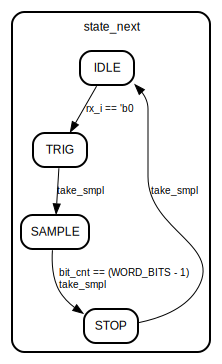

# Entity: tuart_rx 

- **File**: tuart_rx.sv
## Diagram

## Generics

| Generic name   | Type | Value | Description |
| -------------- | ---- | ----- | ----------- |
| WORD_BITS      |      | 8     |             |
| OPC_WORDS      |      | 1     |             |
| CMD_WORDS      |      | 4     |             |
| CLK_PER_SAMPLE |      | 4     |             |
## Ports

| Port name | Direction | Type                      | Description              |
| --------- | --------- | ------------------------- | ------------------------ |
| clk_i     | input     |                           | system clock             |
| rst_in    | input     |                           | system reset, low active |
| rx_i      | input     |                           | uart rx input            |
| opc_o     | output    | [WORD_BITS*OPC_WORDS-1:0] | received opcode          |
| cmd_o     | output    | [WORD_BITS*CMD_WORDS-1:0] | received command         |
| stb_o     | output    |                           | flag, receive complete   |
## Signals

| Name             | Type                                 | Description |
| ---------------- | ------------------------------------ | ----------- |
| state            | states_t                             |             |
| state_next       | states_t                             |             |
| smpl_cnt         | logic [$clog2(CLK_PER_SAMPLE+1)-1:0] |             |
| smpl_cnt_next    | logic [$clog2(CLK_PER_SAMPLE+1)-1:0] |             |
| smpl_cnt_compare | logic [$clog2(CLK_PER_SAMPLE+1)-1:0] |             |
| bit_cnt          | logic [$clog2(WORD_BITS)-1:0]        |             |
| bit_cnt_next     | logic [$clog2(WORD_BITS)-1:0]        |             |
| word_cnt         | logic [$clog2(CMD_WORDS+1)-1:0]      |             |
| word_cnt_next    | logic [$clog2(CMD_WORDS+1)-1:0]      |             |
| shft_data        | logic [OUT_WIDTH-1:0]                |             |
| shft_data_next   | logic [OUT_WIDTH-1:0]                |             |
| take_smpl        | logic                                |             |
| short_cmd_ready  | logic                                |             |
| long_cmd_ready   | logic                                |             |
| default          | endclocking                          |             |
| f_pre_init       | logic                                |             |
| f_init           | logic                                |             |
| rst_in           | asme_init_rst                        |             |
| rx_i             | asme_rst_rx                          |             |
| word_cnt         | asme_rst_wcnt                        |             |
| state            | asme_vld_uart                        |             |
| rx_i             | asme_vld_uart                        |             |
| rx_i             | asme_vld_uart                        |             |
| CLK_PER_SAMPLE   | asme_vld_uart                        |             |
| CMD_WORDS        | asrt_word_cnt                        |             |
| WORD_BITS        | asrt_bit_cnt                         |             |
| state            | asrt_start                           |             |
| stb_o            | asrt_no_stb                          |             |
## Constants

| Name      | Type | Value     | Description |
| --------- | ---- | --------- | ----------- |
| OUT_WIDTH |      | WORD_BITS |             |
## Types

| Name     | Type                                                                                                                                                                                      | Description |
| -------- | ----------------------------------------------------------------------------------------------------------------------------------------------------------------------------------------- | ----------- |
| states_t | enum bit [1:0] { IDLE,  TRIG,  SAMPLE,  STOP} |             |
## Processes
- main_fsm: (  )
  - **Type:** always_comb
- shift_reg: ( @(posedge clk_i) )
  - **Type:** always_ff
- f_initial_reset: ( @(posedge clk_i) )
  - **Type:** always_ff
## Instantiations

- iff: disable
## State machines

