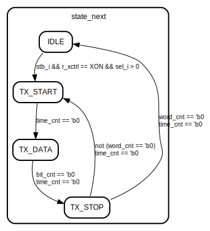

# Entity: tuart_tx 

- **File**: tuart_tx.sv
## Diagram

## Generics

| Generic name   | Type | Value | Description |
| -------------- | ---- | ----- | ----------- |
| WORD_BITS      |      | 8     |             |
| CMD_WORDS      |      | 4     |             |
| CLK_PER_SAMPLE |      | 10    |             |
## Ports

| Port name | Direction | Type                          | Description              |
| --------- | --------- | ----------------------------- | ------------------------ |
| clk_i     | input     |                               | system clock             |
| rst_in    | input     |                               | system reset, low active |
| stb_i     | input     |                               | flag, start tx           |
| rdy_o     | output    |                               | flag, ready for next tx  |
| tx_o      | output    |                               | uart tx output           |
| xstb_i    | input     |                               | flag, update x{on,off}   |
| xoff_i    | input     |                               | flag, xoff               |
| xon_i     | input     |                               | flag, xon                |
| data_i    | input     | [(WORD_BITS)*(CMD_WORDS)-1:0] | data to transmit         |
## Signals

| Name          | Type                                | Description |
| ------------- | ----------------------------------- | ----------- |
| shft_reg      | logic [(WORD_BITS)*(CMD_WORDS)-1:0] |             |
| shft_reg_next | logic [(WORD_BITS)*(CMD_WORDS)-1:0] |             |
| bit_cnt       | logic [$clog2(WORD_BITS)-1:0]       |             |
| bit_cnt_next  | logic [$clog2(WORD_BITS)-1:0]       |             |
| word_cnt      | logic [$clog2(CMD_WORDS)-1:0]       |             |
| word_cnt_next | logic [$clog2(CMD_WORDS)-1:0]       |             |
| time_cnt      | logic [$clog2(CLK_PER_SAMPLE)-1:0]  |             |
| time_cnt_next | logic [$clog2(CLK_PER_SAMPLE)-1:0]  |             |
| state         | states_t                            |             |
| state_next    | states_t                            |             |
| r_xctrl       | xcrtl_t                             |             |
## Constants

| Name           | Type | Value                | Description |
| -------------- | ---- | -------------------- | ----------- |
| START_BIT_NR   |      | 'd12                 |             |
| TIME_CNT_START |      | CLK_PER_SAMPLE - 'b1 |             |
## Types

| Name     | Type                                                                                                                                                                                              | Description |
| -------- | ------------------------------------------------------------------------------------------------------------------------------------------------------------------------------------------------- | ----------- |
| states_t | enum bit [1:0] { IDLE,  TX_START,  TX_DATA,  TX_STOP} |             |
## Processes
- next_state_logic: (  )
  - **Type:** always_comb
- fsm: ( @(posedge clk_i) )
  - **Type:** always_ff
- flow_control: ( @(posedge clk_i) )
  - **Type:** always_ff
## State machines

